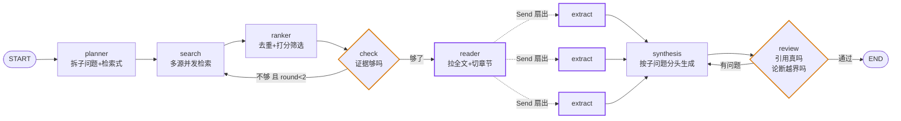
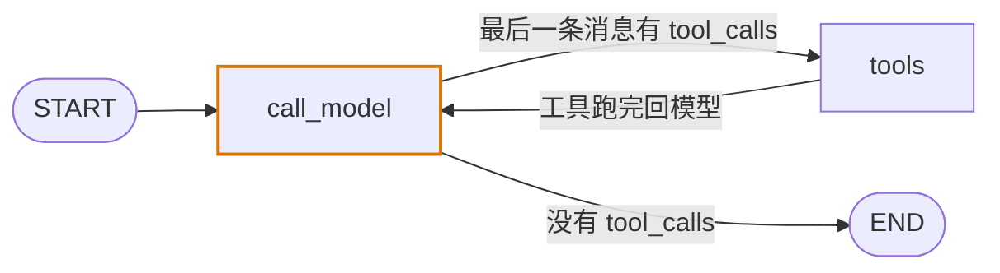

# agent-interview

一个**从零上手 LangChain / LangGraph 的练手项目**，顺带把 Agent 方向的面试准备做掉。

三条线并进：

1. **熟悉框架** —— 21 个 commit 一步一个概念，从 20 行的最小图走到 9 节点带双回边的完整图
2. **做一个真项目** —— 同一个文献综述业务，用三种 Agent 形态各实现一遍，跑数据对照
3. **沉淀面试素材** —— 每个实测结论都记下来，两份速记 + 一份评测设计文档

选题、架构、验收标准来自 [AgentGuide](https://github.com/adongwanai/AgentGuide) 的
[Paper Agent 项目蓝图](https://github.com/adongwanai/AgentGuide/blob/main/projects/01-paper-agent/README.md)。

---

## 这个项目做什么

输入一个研究问题，输出一份每句话都能回溯到具体论文具体章节的综述。

```
"单细胞 RNA-seq 的批次效应校正方法哪类更可靠"
                    ↓
深度学习类方法在测试中常大幅改动数据，产生可测量的伪影 [PMC12315870 · Abstract]。
相比之下线性方法 ComBat 与 Harmony 引入的伪影最少，其中 Harmony 是唯一在批次无
局部偏差时减弱校正的方法 [PMC12315870 · Discussion]。

## 证据不足，未能回答
- 不同校正方法对轨迹推断结果的影响
```

数据源是 Europe PMC 和 arXiv，全部免注册免 key。

---

## 三种形态

| | 谁决定下一步 | 代码规模 | 入口 |
|:---|:---|:---|:---|
| **workflow** | 代码写死每条边 | 9 节点 · 2 条回边 · 1 次扇出 · 18 个文件 | `agents/workflow/` |
| **react** | 模型看着工具列表自己决定 | 2 节点 · 1 条回边 · **33 行** | `agents/react.py` |
| **harness** | 模型 + 文件系统 + 子代理 | 2 节点 + middleware · **37 行** | `agents/harness.py` |

**这个不对称本身就是结论。** 三者用同一套工具、同一个模型、解决同一个问题。

### 形态一：workflow

每条边都是代码写死的业务流程。模型只在节点内部干活，从不决定"下一步做什么"。



两条橙色回边是 LCEL 写不出的形状：跑几轮由运行时状态决定。紫色虚线是 Send 扇出，
实例数等于筛后论文数，运行时才知道。

节点与 AgentGuide 蓝图的对应关系：

| 节点 | 蓝图里的 | 职责 |
|:---|:---|:---|
| `planner` | Planner | 研究问题 → 子问题 + 每个子问题的检索式 |
| `search` | Paper Search Tools | 所有（源 × 检索式）组合并发查 |
| `ranker` | Paper Ranker | 跨源去重 + LLM 逐篇打分筛选 |
| `check` | （本项目补充） | 数每个子问题剩几篇，不够就换检索式回 `search` |
| `reader` | PDF Reader | 拉 Europe PMC 全文 XML，按章节切开并截断 |
| `extract` | Evidence Store | Send 扇出，每篇论文一个实例并发抽证据 |
| `synthesis` | Synthesis Agent | 按子问题分头生成，每节只喂它自己的证据 |
| `review` | Review Agent | 代码查引用真伪 + 模型查论断越界，有问题回 `synthesis` |

### 形态二：react

全部图代码四行，没有一条编码业务流程。

```python
builder.add_node("call_model", call_model)
builder.add_node("tools", ToolNode(TOOLS))
builder.add_edge(START, "call_model")
builder.add_conditional_edges("call_model", tools_condition)   # 模型决定
builder.add_edge("tools", "call_model")                        # 工具跑完回模型
```



流程是模型自己走出来的：并发查两条检索式 → 觉得不够再来两条 → 决定读某篇的 Results
→ 又读 Discussion → 中途想起还要查过校正 → 材料够了收工。

终止权完全在模型手上 —— 它不再点名工具，循环就停。`recursion_limit` 只是安全网，
撞上时抛异常且**已完成的工作全部丢失**。

### 形态三：harness

在 react 基础上，[deepagents](https://github.com/langchain-ai/deepagents) 白送九个工具：

```
文件系统   ls / read_file / write_file / edit_file / delete / glob / grep
代码执行   execute
子代理     task —— 委派给独立上下文窗口的子代理，跑完只带结果回来
```

文件系统的意义是**上下文卸载**：读到的全文写盘，主对话里只留文件名。

---

## 实测数据

三道难度递增的题，同一模型同一套工具，均值：

| 形态 | 秒 | 模型调用 | 输入 token | 输出 token | 工具次 | 引用条数 | 伪引用 |
|:---|---:|---:|---:|---:|---:|---:|---:|
| workflow | 68 | 67 | 54200 | 8539 | 28 | 16.7 | 0 |
| react | 94 | 10 | 47316 | 2653 | 17 | 12.3 | 0 |
| harness | 97 | 9 | 68530 | 2661 | 17 | 13.7 | 0 |

**模型调用次数与 token 成本反相关。** workflow 调用 67 次却只花 54K 输入 token，
因为每次只喂那一步需要的材料；agent 调用 10 次花 47-68K，因为每一轮都把整个对话
历史重发一遍。**agent 形态的 token 成本随轮次二次增长。**

**分题看结论完全反转：**

| 题 | 特点 | workflow 引用 | agent 引用 |
|:---|:---|---:|---:|
| 批次效应校正方法对比 | 文献密集、术语标准 | **28** | 10–12 |
| 空间转录组反卷积 | 交叉领域、同义词多 | **3** | 13–18 |
| doublet 检测失效模式 | 偏工程、文献稀疏 | **19** | 12–13 |

第二题 workflow 撞上写死的 `MAX_ROUNDS=2`，只产出 774 字、3 条引用 —— **而且不报错**，
交出一份看起来正常实则敷衍的报告。

**关键差异是失败模式**：workflow 的失败是静默降级，agent 的失败是成本失控。
选型取决于更怕哪一种。

复现：`uv run python -m agents.bench`，明细见 [`docs/bench_result.json`](docs/bench_result.json)。

---

## 跑起来

```bash
git clone <this-repo> && cd agent-interview
uv sync

cp .env.example .env      # 填 OPENAI_API_KEY，兼容任何 OpenAI 协议的服务
```

`.env` 里 `OPENAI_BASE_URL` 默认指向 DeepSeek，换成任何 OpenAI 兼容端点都行。

```bash
uv run python -m agents.workflow    # 形态一，产出 report.md
uv run python -m agents.bench       # 三形态对照跑分
```

单独跑另外两个形态：

```python
import asyncio
from langchain_core.messages import HumanMessage
from agents.react import graph          # 或 agents.harness

asyncio.run(graph.ainvoke(
    {"messages": [HumanMessage("你的研究问题")]},
    {"recursion_limit": 40}))
```

人工确认检索式（会在 `planner` 之后停下来）：

```python
from agents.workflow.graph import with_hitl
from langgraph.types import Command

g = with_hitl()
cfg = {"configurable": {"thread_id": "任意ID"}}
out = await g.ainvoke({"question": "..."}, cfg)
print(out["__interrupt__"][0].value)          # 看它打算怎么查
await g.ainvoke(Command(resume="ok"), cfg)    # 放行；或传改好的检索式列表
```

---

## 跟着 commit 学

**这个仓库的历史就是教程。** 前 21 个 commit 一步一个概念，每一步只加一样东西，
从"什么都不会"走到"9 节点带双回边"。适合没写过 LangGraph 的人照着走一遍。

```bash
git log --oneline --reverse
git checkout <commit>       # 停在任意一步
```

| step | 加了什么 | 学到 |
|:---:|:---|:---|
| 0 | 20 行的最小图 | State / 节点 / 边 / `compile` |
| 1 | 第二个节点 | 节点返回**补丁**不是新状态 |
| 2 | `Annotated[list, add]` | reducer：字段是覆盖还是归约 |
| 3 | `add_conditional_edges` | 分支：下一步跑谁由状态决定 |
| 4 | 条件边指回自己 | **循环** + `recursion_limit` 兜底 |
| 5 | 节点里调 LLM | 图结构一个字没改 |
| 6 | `with_structured_output` | 模型返回对象，条件边才读得懂 |
| 7 | 调 Europe PMC | 节点碰外部世界 |
| 8 | 模型直接产出检索式 | 代码拼关键词拼不过模型 |
| 9 | `async def` + `gather` | 异步节点必须 `ainvoke` |
| 10 | 目录扁平化 | —— |
| 11 | 去重 + LLM 打分 | 自定义 reducer；`abatch` 并发 |
| 12 | `check` + 回边 | **第一个真循环**，LCEL 写不出的形状 |
| 13 | 全文 XML + 章节切分 | 双层截断；失败隔离在最内层 |
| 14 | **Send 扇出** | reducer 从"概念"变成"不加就跑不了" |
| 15 | 按子问题分头生成 | 约束大于提示：让模型没材料可编 |
| 16 | 两层校验 + 重写回边 | 能用代码查死的绝不交给模型 |
| 17 | react 形态 | 模型驱动 vs 图驱动 |
| 18 | harness 形态 + 跑分 | 三形态对照 |
| 19 | 三题批量跑分 | 数据说话 |
| 20 | `interrupt` + checkpointer | 恢复时节点**从头重跑** |

每一步的设计取舍、踩过的坑、实测结论都写在代码注释里。

---

## 面试素材

做的过程中每个实测结论都记下来了，三份文档可以直接当复习材料：

| 文档 | 内容 |
|:---|:---|
| [`docs/notes-langgraph.md`](docs/notes-langgraph.md) | 十二节 + 四条标准答法。执行模型、reducer 的四种组合、Send 扇出、interrupt 恢复语义、三形态对照、非 OpenAI 厂商的三个 400、限流的三种形态 |
| [`docs/eval-design.md`](docs/eval-design.md) | 评测设计。先枚举失败模式再倒推指标；硬约束（代码可判定，阈值必须 100%）与软质量分层；金标准怎么造；LLM-as-judge 的使用边界；指标被 game 的方式 |
| [`docs/notes-langchain.md`](docs/notes-langchain.md) | LangChain 速记。Runnable 协议、LCEL 组合原语、结构化输出、类型契约、LCEL 的能力边界 |

每条结论都有实测支撑，不是背文档。比如：

> **问：LangGraph 和 LangChain 什么关系？**
>
> LCEL 用 `|` 组合 Runnable，得到编译期定死的有向无环管道，数据在算子之间穿过。
> LangGraph 是节点读写共享状态、边描述跳转的状态机，支持环、支持中断恢复。
> 判断标准是流程形状：一条直线跑一次就用 LCEL，LangGraph 在那种场景是纯负担；
> 需要循环、需要多节点并发写同一累加器、需要中途停下来等人，才换 LangGraph。
> 两者不是替代关系 —— 节点内部的单步逻辑仍然用 LCEL 写最省事。

对应 AgentGuide [开发岗专项题库](https://github.com/adongwanai/AgentGuide/blob/main/docs/04-interview/06-development-specialized.md)
里的 Q4（设计 Agent 工作流引擎）、Q6（Agent 框架选型）、Q9（Agent 评估平台）、
Q11（状态持久化）、性能优化 Q4（长对话）、Q6（异常重试）、Q8（并发控制）。

---

## 目录

```
agents/
├── workflow/          形态一：9 节点完整实现
│   ├── graph.py          装配（batch 变体 + HITL 变体）
│   ├── state.py          共享状态，哪些字段需要 reducer
│   ├── models.py         业务对象 + 跨源去重
│   ├── llm.py            共享模型实例
│   ├── sources/          Europe PMC / arXiv
│   └── nodes/            一节点一文件
├── react.py           形态二：33 行
├── harness.py         形态三：37 行
├── tools.py           三形态共享的工具（带重试，错误返回文本不抛异常）
└── bench.py           对照跑分

docs/
├── notes-langgraph.md    LangGraph 速记：执行模型、reducer、Send、interrupt 等十二节
├── eval-design.md        评测设计：先枚举失败模式再倒推指标
├── notes-langchain.md    LangChain 速记（前置阶段）
└── bench_result.json     跑分明细，含三形态各自产出的完整报告

langchain-demo/        前置阶段：纯 LCEL 实现的 JD × 简历匹配，六步递进
```

---

## 几条实测结论

写在代码注释里，这里摘几条最反直觉的：

**补丁里的未知字段被静默丢弃。** 返回 `{"conut": 999}` 不报错不警告，值直接消失。

**有 reducer 的字段被预初始化。** `Annotated[list, list.__add__]` 无人写过时读出 `[]`，
裸 `list` 则压根不在状态里。所以读前者可直接下标，读后者必须 `.get()`。

**reducer 是字段级且全局的。** 一旦标记，任何节点写它都只能追加。本项目曾因此
让去重节点的 18 条结果被拼在原 19 条之后得到 37 条。

**`interrupt` 恢复时节点从头重跑**，不是从中断行继续。所以 interrupt 必须放在
纯节点里 —— 放进含 LLM 调用的节点会重复计费。

**限流器只管间隔，管不了总量。** OpenAlex 走信用点配额（1000 点、每次扣 10、
约 16.5 小时重置），耗尽时返回的也是普通 429，与"太快了"无法从状态码区分。

**LangGraph 从不跨进程。** async 节点在主事件循环，同步节点在线程池，pid 始终相同。
所谓分布式能力全部来自状态可序列化。

更多见 [`docs/notes-langgraph.md`](docs/notes-langgraph.md)。

---

## 致谢

### [AgentGuide](https://github.com/adongwanai/AgentGuide)

这个项目的选题、架构和验收标准全部来自 AgentGuide。具体用到的：

- [**Paper Agent 项目蓝图**](https://github.com/adongwanai/AgentGuide/blob/main/projects/01-paper-agent/README.md)
  给出了完整架构（Planner → Search Tools → Ranker → PDF Reader → Evidence Store →
  Synthesis → Review），本项目的 `agents/workflow/nodes/` 与之一一对应
- [**2026 Agent 求职通关路线**](https://github.com/adongwanai/AgentGuide/blob/main/docs/05-roadmaps/agent-job-ready-roadmap-2026.md)
  的 Stage 7-8 定死了"什么程度算合格"：20 条 eval case、trace 可回放、
  README 能让别人 clone 跑通、简历要从架构/业务/结果三维表达
- [**如何落地一个可写进简历的 Agent 项目**](https://github.com/adongwanai/AgentGuide/blob/main/docs/03-practice/05-ship-agent-project.md)
  的"先写 Spec 再写代码"和可靠性六件套
- [**开发岗专项题库**](https://github.com/adongwanai/AgentGuide/blob/main/docs/04-interview/06-development-specialized.md)
  的 Q4「设计一个 Agent 工作流引擎（类似 LangGraph）」是本项目最初的动机之一

没有这份蓝图，这个项目大概率会做成又一个"调 API 拼字符串"的 demo。

### 参考实现

业务流程照以下项目的既有实现，而非自行发明：

- [GPT Researcher](https://github.com/assafelovic/gpt-researcher) —— 先检索再拆子问题、按子问题并发、失败隔离在源层、`WorkerPool` 的并发与限流分离
- [OpenScholar](https://github.com/AkariAsai/OpenScholar) —— feedback 环、改写长度守卫、`max_per_paper`、引用 posthoc 回填
- [The AI Scientist](https://github.com/SakanaAI/AI-Scientist) —— 研究型 Agent 的输出边界
- [deepagents](https://github.com/langchain-ai/deepagents) —— 形态三直接使用

## License

MIT
